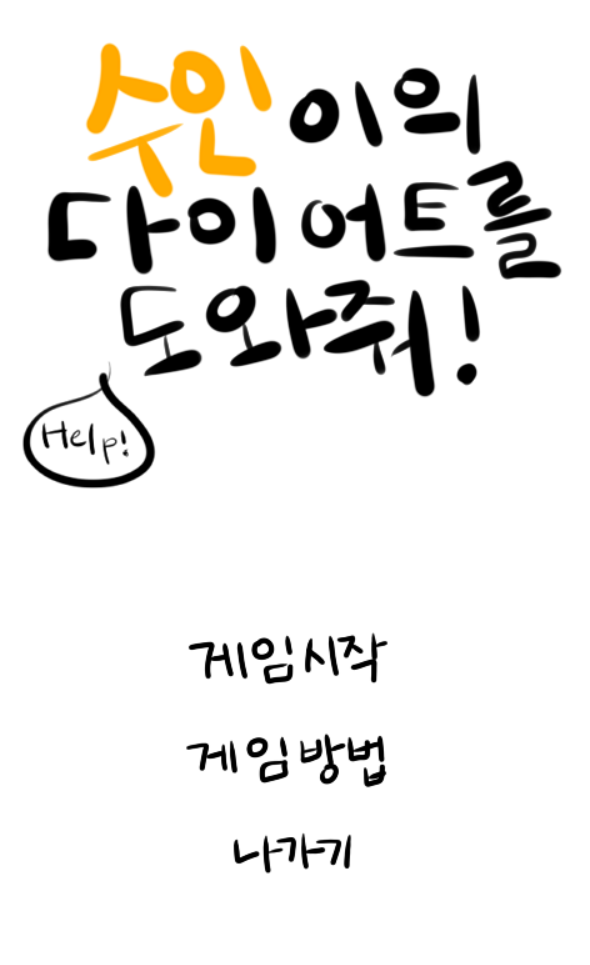

# OpenGL 기반 게임

개발: C++, OpenGL, Win32
업무포지션: 대학생

## 👩‍🏫PROJECT 소개

---

OpneGL 학습용 미니게임 제작

🗓️ **작업기간** : 2학년 2학기

👨‍💻 **투입인원** : 1인개발

🙋‍♀️ **기여도 :** 100% 

📒 **주요 성과** 

- OpenGL 학습
- Win32 API 학습

🌱 **스킬 및 사용툴**

 `OpenGL` `visualStudio` 

## 🖌️더 알아보기

---

### 플레이 영상

[https://www.youtube.com/watch?v=thIIEEcLJgg&feature=youtu.be](https://www.youtube.com/watch?v=thIIEEcLJgg&feature=youtu.be)

